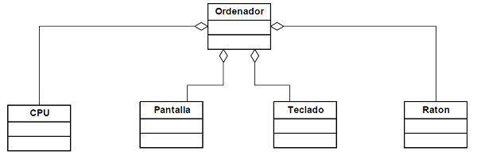

Agregación
======

Las relaciones de agregación se basan en la idea de observar o entender un objeto como una composición de otros objetos. Desde nuestro punto de vista, las relaciones de agregación se entenderán `como relaciones en las cuales una serie de clases aparecen como tipos de los atributos de otra clase`...

Estas relaciones se conocen también como relaciones **todo - partes**. El **todo** está representado por la clase que aglutina a las otras clases, y las **partes** están dadas por las diversas clases que aparecen.

La mejor forma de identificar si nos encontramos ante una relación de agregación es preguntarnos si la clase que queremos definir **tiene un** atributo de la otra clase que estemos usando. 

- Veamos un ejemplo un diagrama UML 

Un ordenador es el resultado de 'agregar' una serie de componentes, como una 'CPU', una 'Pantalla', un 'Teclado' y un 'Raton' (y quizá algunos adicionales). De nuevo podemos -aplicar el 'test' de un objeto de la clase 'Ordenador' `tiene --una` "**CPU**" y `tiene --una` "**Pantalla**", y `tiene --una` "**Teclado**" y `tiene --una` "**Raton**".

Basados en esta idea, existe un tipo particular de agregación, llamada **composición(o también agregación fuerte)**,en la cual los objetos agregados no tienen sentido fuera del objeto resultante. También se puede entender la composición como una relación en la que los objetos agregados deben dejar de existir cuando lo hace el objeto compuesto.
######[Ejemplo de Composición](composicion.md)